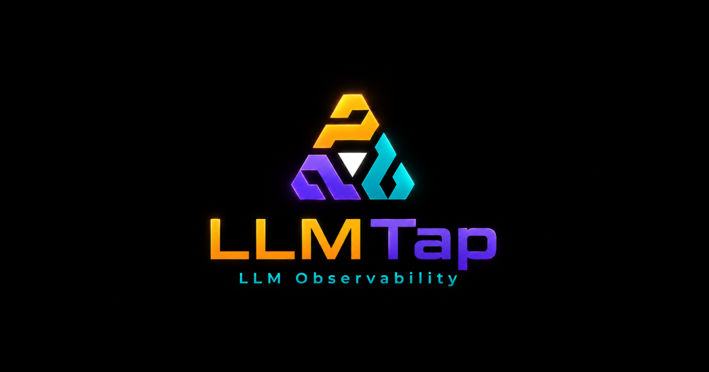

<p align="center">
  
</p>

<h1 align="center">LLMTap</h1>

<p align="center">
  <strong>Local-first observability for AI agent developers.</strong><br />
  Trace every LLM call, inspect agent workflows, and watch cost/latency move in real time.
</p>

<p align="center">
  <a href="https://www.npmjs.com/package/llmtap"></a>
  <a href="https://github.com/DivyaanshuXD/LLMTap/actions"></a>
  <a href="https://github.com/DivyaanshuXD/LLMTap/stargazers"></a>
  <a href="./LICENSE"></a>
</p>

<p align="center">
  <a href="#quick-start">Quick Start</a>
  ·
  <a href="#what-you-get">What You Get</a>
  ·
  <a href="#providers">Providers</a>
  ·
  <a href="#api">API</a>
  ·
  <a href="#architecture">Architecture</a>
</p>

---

LLMTap is the fastest way to see what your AI app is doing locally.

No cloud account. No proxy. No hosted dashboard. Start the collector with one command, wrap the client your app already uses, and watch traces appear in a live mission-control dashboard.

```bash
npx llmtap
```

The dashboard opens at `http://localhost:4781`.

## Quick Start

Install the SDK in the app you want to observe:

```bash
pnpm add @llmtap/sdk
```

Wrap the LLM client where it is created:

```ts
import OpenAI from "openai";
import { wrap } from "@llmtap/sdk";

const openai = wrap(new OpenAI());

const response = await openai.chat.completions.create({
  model: "gpt-4o-mini",
  messages: [{ role: "user", content: "Explain LLM observability in one paragraph." }],
});
```

Run your app normally. Each real model call appears in LLMTap with:

- request timeline
- provider and model
- token usage
- estimated cost
- latency
- grouped session/trace detail
- captured messages, unless disabled

## What You Get

| Capability | Why it matters |
| --- | --- |
| Live traces | See requests as they happen, including streaming completions. |
| Cost intelligence | Catch expensive model paths before they become a bill surprise. |
| Session grouping | Follow multi-step agent work as one execution story. |
| Local SQLite storage | Keep development traces on your machine by default. |
| Provider detection | Works with major SDKs and OpenAI-compatible providers. |
| OTLP export | Forward traces to Grafana, Jaeger, Datadog, or another backend when needed. |
| Demo mode | Generate synthetic traces to test the dashboard without an API key. |

## Providers

LLMTap supports the common SDK shapes used by modern LLM apps.

| Provider | Setup |
| --- | --- |
| OpenAI | `wrap(new OpenAI())` |
| Anthropic | `wrap(new Anthropic())` |
| Google Gemini | `wrap(new GoogleGenerativeAI(apiKey))` |
| Groq | OpenAI-compatible client |
| DeepSeek | OpenAI-compatible client |
| Together AI | OpenAI-compatible client |
| Fireworks | OpenAI-compatible client |
| OpenRouter | OpenAI-compatible client |
| xAI / Grok | OpenAI-compatible client |
| Ollama | OpenAI-compatible local endpoint |
| Vercel AI SDK | `wrapVercelAI()` |

Example with an OpenAI-compatible provider:

```ts
import OpenAI from "openai";
import { wrap } from "@llmtap/sdk";

const groq = wrap(
  new OpenAI({
    apiKey: process.env.GROQ_API_KEY,
    baseURL: "https://api.groq.com/openai/v1",
  }),
  { provider: "groq" }
);
```

## API

### `wrap(client, options?)`

Returns a proxy around your existing client. Your app keeps using the same methods.

```ts
const client = wrap(new OpenAI(), {
  provider: "openai",
  tags: { env: "dev" },
});
```

### `startTrace(name, fn, options?)`

Group multiple LLM calls into one trace.

```ts
import { startTrace, wrap } from "@llmtap/sdk";

const client = wrap(new OpenAI());

await startTrace(
  "support-agent",
  async () => {
    await client.chat.completions.create({
      model: "gpt-4o-mini",
      messages: [{ role: "user", content: "Classify this ticket." }],
    });

    await client.chat.completions.create({
      model: "gpt-4o-mini",
      messages: [{ role: "user", content: "Draft a reply." }],
    });
  },
  { sessionId: "ticket-123" }
);
```

### `init(config)`

Configure capture behavior globally.

```ts
import { init } from "@llmtap/sdk";

init({
  collectorUrl: "http://localhost:4781",
  captureContent: true,
  enabled: true,
  debug: false,
  sessionId: "local-dev",
});
```

| Config | Env var | Default |
| --- | --- | --- |
| `collectorUrl` | `LLMTAP_COLLECTOR_URL` | `http://localhost:4781` |
| `captureContent` | `LLMTAP_CAPTURE_CONTENT` | `true` |
| `enabled` | `LLMTAP_ENABLED` | `true` |
| `debug` | `LLMTAP_DEBUG` | `false` |
| `sessionId` | `LLMTAP_SESSION_ID` | unset |

## CLI

```bash
npx llmtap                     # start collector + dashboard
npx llmtap --demo              # start with sample traffic
npx llmtap --port 8080         # run on a custom port
npx llmtap --retention 7d      # auto-delete old local data
npx llmtap --host 0.0.0.0      # expose collector on your network
npx llmtap status              # inspect local database status
npx llmtap doctor              # diagnose empty dashboard states
npx llmtap backup              # create a SQLite backup
npx llmtap export -f json      # export traces
npx llmtap import traces.json  # import exported traces
npx llmtap restore backup.db   # restore a database backup
```

## Architecture

```text
Your app
  |
  | wrap(client)
  v
@llmtap/sdk
  |
  | batched HTTP spans
  v
@llmtap/collector  ---- Server-Sent Events ---->  dashboard
  |
  | local writes
  v
SQLite database
  |
  | optional
  v
OTLP export to Grafana, Jaeger, Datadog, or another backend
```

| Package | Purpose |
| --- | --- |
| `llmtap` | CLI that starts the local collector and bundled dashboard. |
| `@llmtap/sdk` | Proxy-based instrumentation for LLM clients. |
| `@llmtap/collector` | Fastify API, SQLite storage, SSE stream, exports. |
| `@llmtap/dashboard` | React/Vite mission-control dashboard. |
| `@llmtap/shared` | Shared types, pricing, and OTLP utilities. |

## Privacy

LLMTap is local-first. By default, traces are stored in a SQLite database on your machine. Nothing is sent to LLMTap servers because there are no LLMTap servers.

If you configure OTLP export, your traces are forwarded to the endpoint you choose. If you disable content capture, message bodies are not stored.

## Troubleshooting

If the dashboard is open but empty:

```bash
npx llmtap doctor
```

Most empty states are caused by one of these:

- the app you are testing is not using `@llmtap/sdk`
- the LLM client was created but not wrapped
- the app has not made a real model call yet
- the app is pointing to a different collector URL

## Development

```bash
git clone https://github.com/DivyaanshuXD/LLMTap.git
cd LLMTap
pnpm install --frozen-lockfile
pnpm build
pnpm test
```

Target runtime: Node.js 18 or newer.

## License

MIT
